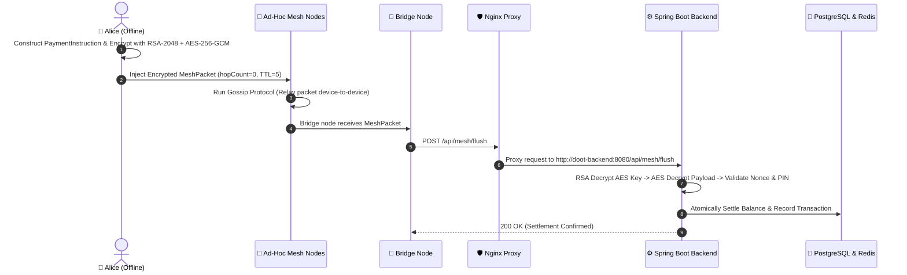

# 🌐 DOOT — Decentralized Offline-Online Transaction Protocol

[](https://www.adoptium.net/)
[](https://spring.io/projects/spring-boot)
[](https://react.dev/)
[](https://www.typescriptlang.org/)
[](https://tailwindcss.com/)
[](https://nginx.org/)
[](https://www.postgresql.org/)
[](https://redis.io/)
[](https://www.docker.com/)

> **DOOT** is a high-performance, privacy-preserving offline mesh payment protocol and interactive simulation platform. It enables financial transactions in environments without internet connectivity by utilizing **hybrid envelope cryptography (RSA-2048 + AES-256-GCM)**, **peer-to-peer gossip propagation**, and **automated bridge node ledger settlement**.

---

## 🌟 Key Features

- 🔐 **Hybrid Envelope Cryptography**: Payment payloads are encrypted on-device with a unique single-use AES-256-GCM key, which is itself encrypted using RSA-2048 OAEP with SHA-256. Intermediary mesh devices relay encrypted packets without reading payload contents.
- 📡 **Offline Mesh Gossip Relay**: Ad-hoc device-to-device packet propagation with TTL-based hop limits and duplicate suppression.
- 🌉 **Automated Bridge Settlement**: Internet-connected gateway nodes collect held mesh packets and securely flush them to the Spring Boot ledger backend for validation and execution.
- 🛡️ **Double-Spending & Replay Protection**: Strict nonce checking combined with Redis-backed idempotency caching to reject duplicate or replayed transactions.
- 🖥️ **Interactive React Dashboard**: Real-time visual network topology graph, transaction ledger explorer, wallet account inspector, and interactive mesh controls (Send, Gossip Round, Bridge Flush, Reset).
- 🐳 **Zero-Config Docker Deployment**: Single-command containerized production stack managed by Nginx reverse proxy serving static React assets and forwarding `/api/*` requests to Spring Boot.

---

## 🏗️ System Architecture

```
                  ┌────────────────────────────────────────────────────────┐
                  │                 BROWSER / CLIENT ORIGIN                │
                  │                   http://localhost:80                  │
                  └───────────────────────────┬────────────────────────────┘
                                              │
                                       ┌──────┴──────┐
                                       │    NGINX    │ (Port 80 Container)
                                       └──────┬──────┘
                                              │
                     ┌────────────────────────┴────────────────────────┐
                     │                                                 │
            location /                                          location /api/*
                     │                                                 │
         ┌───────────▼───────────┐                         ┌───────────▼───────────┐
         │     REACT APP         │                         │  SPRING BOOT BACKEND  │
         │ (Static HTML/JS/CSS)  │                         │  doot-backend:8080    │
         └───────────────────────┘                         └───────────┬───────────┘
                                                                       │
                                                   ┌───────────────────┴───────────────────┐
                                                   │                                       │
                                        ┌──────────▼──────────┐                 ┌──────────▼──────────┐
                                        │  REDIS MESH STORE   │                 │ POSTGRESQL LEDGER   │
                                        │   localhost:6379    │                 │   localhost:5432    │
                                        └─────────────────────┘                 └─────────────────────┘
```

---

## 🔄 End-to-End Payment Flow



---

## 🛠️ Technology Stack

| Layer | Technology | Purpose |
| :--- | :--- | :--- |
| **Frontend** | React 18, TypeScript, Vite | Single-Page Application UI |
| **Styling** | Tailwind CSS, Lucide Icons, Shadcn UI | Modern responsive interface |
| **State & API** | TanStack React Query v5, Axios / Fetch | API caching, automatic refetching |
| **Backend** | Java 17, Spring Boot 3.2.4 | REST Web Services & Cryptographic Engine |
| **Security** | RSA-2048 OAEP, AES-256-GCM, Jackson JSR-310 | Envelope encryption & timestamp serialization |
| **Databases** | PostgreSQL 16, Redis 7 | Relational transaction ledger & in-memory mesh packet store |
| **Reverse Proxy** | Nginx Alpine | Static file server & `/api` reverse proxy |
| **Orchestration** | Docker & Docker Compose | Containerized service stack |

---

## 🚀 Quick Start (Production Docker Stack)

### Prerequisites
- [Docker Desktop](https://www.docker.com/products/docker-desktop/) (with Docker Compose)

### Running the Stack

1. **Clone the repository**:
   ```bash
   git clone https://github.com/Atharv-7076B/DOOT.git
   cd DOOT
   ```

2. **Launch all services**:
   ```bash
   docker compose up -d --build
   ```

3. **Access the application**:
   - 🌐 **Frontend App**: [http://localhost](http://localhost)
   - ⚙️ **Backend API**: [http://localhost:8080/api/mesh/state](http://localhost:8080/api/mesh/state)
   - 📊 **RedisInsight**: [http://localhost:5540](http://localhost:5540)

4. **Stop the stack**:
   ```bash
   docker compose down
   ```

---

## 💻 Local Development Setup

### Frontend Development

```bash
cd doot-frontend/doot-frontend

# Install dependencies
npm install

# Start Vite dev server with proxy to localhost:8080
npm run dev
```
Open [http://localhost:5173](http://localhost:5173) in your browser.

### Backend Development

```bash
cd doot-backend/doot-backend

# Build & run Spring Boot application
./mvnw spring-boot:run
```
The backend server runs on `http://localhost:8080`.

---

## 🔌 API Reference

| Method | Path | Description |
| :--- | :--- | :--- |
| `GET` | `/api/mesh/state` | Returns live list of mesh virtual devices and held packets |
| `POST` | `/api/demo/send` | Injects a new encrypted payment packet into the mesh |
| `POST` | `/api/mesh/gossip` | Triggers a P2P gossip propagation round between adjacent devices |
| `POST` | `/api/mesh/flush` | Flushes packets held by Bridge nodes to the backend for settlement |
| `POST` | `/api/mesh/reset` | Resets the mesh network state and idempotency cache |
| `GET` | `/api/accounts` | Retrieves all registered account ledger balances |
| `GET` | `/api/transactions` | Retrieves recent settled transactions history |

### Example Request (`POST /api/demo/send`)

```json
{
  "sender": "alice@doot",
  "receiver": "bob@doot",
  "amount": 100,
  "pin": "1234"
}
```

### Example Response (`201 Created`)

```json
{
  "packetId": "pk-2fdcfff7",
  "ttl": 5,
  "createdAt": "2026-08-14T12:20:49.120Z",
  "hopCount": 0,
  "currentNode": "alice",
  "ciphertext": "WhBVJ8X2KEhO0AkN953WZLLN1VV/ag36..."
}
```

---

## 📂 Project Structure

```
DOOT/
├── docker-compose.yml              # Container orchestration for Postgres, Redis, Backend & Frontend
├── .dockerignore
├── README.md                       # Documentation
│
├── doot-backend/                   # Spring Boot Microservice
│   └── doot-backend/
│       ├── Dockerfile              # Multi-stage Java 17 Maven build
│       ├── pom.xml                 # Maven dependencies
│       └── src/
│           ├── main/java/com/doot/backend/
│           │   ├── configuration/  # Redis & System configs
│           │   ├── controller/     # REST Endpoints (Mesh, Demo, Accounts, Transactions)
│           │   ├── crypto/         # RSA-OAEP + AES-GCM Hybrid Crypto Service
│           │   ├── dto/            # Data transfer objects
│           │   ├── entity/         # JPA & Redis Entities
│           │   ├── repository/     # Data Access Repositories
│           │   └── service/        # Business logic & Bridge Settlement Engine
│           └── main/resources/
│               └── application.properties
│
└── doot-frontend/                  # React Single-Page Application
    └── doot-frontend/
        ├── Dockerfile              # Multi-stage Node build & Nginx static server
        ├── nginx.conf              # Nginx server config & /api reverse proxy
        ├── package.json
        ├── tailwind.config.ts
        ├── vite.config.ts
        └── src/
            ├── api/                # TanStack Query client & hooks
            ├── app/                # Application providers & router
            ├── components/         # Reusable UI components
            ├── features/           # Feature pages (Dashboard, Accounts, Transactions, Packet Explorer)
            └── types/              # TypeScript API definitions
```

---

## 🛡️ Security Architecture

1. **Envelope Encryption**: Raw `PaymentInstruction` objects are encrypted with a fresh AES-256 key for every transaction.
2. **Asymmetric Key Exchange**: The AES key is wrapped with the backend server's RSA-2048 public key. Intermediary nodes cannot view sender/receiver VPAs or transaction amounts.
3. **Integrity Verification**: AES-GCM tags guarantee that tampered or altered ciphertexts are rejected during decryption.
4. **Idempotency**: Every packet features a unique SHA-256 packet hash and nonce, preventing replay attacks across the mesh network.

---

## 📄 License

Distributed under the MIT License. See `LICENSE` for more details.